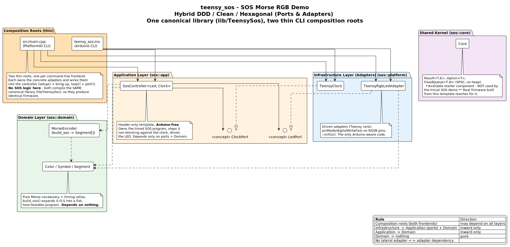
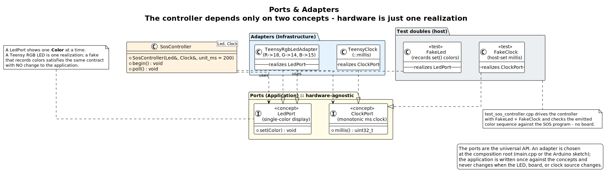
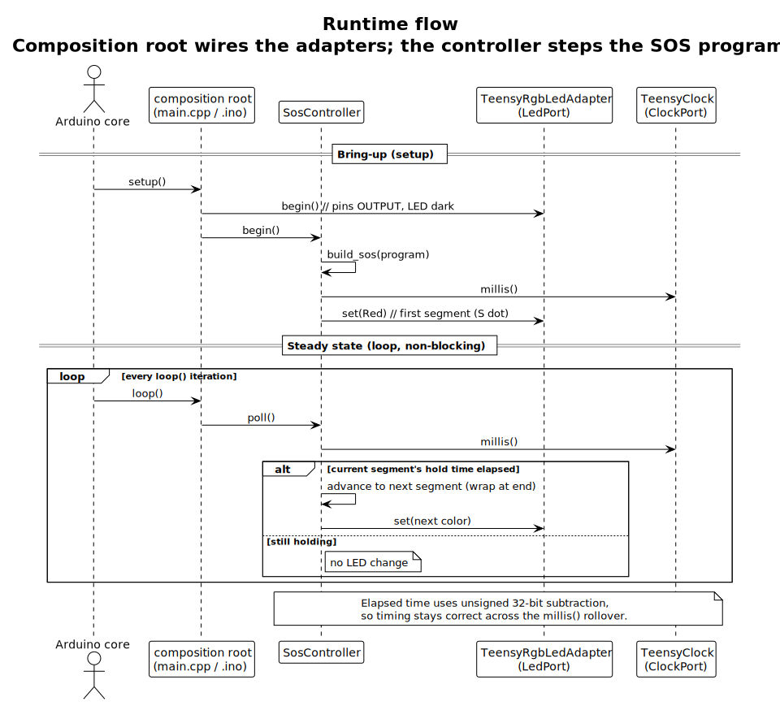

# Architecture — the hybrid DDD / Clean / Hexagonal pattern

`teensy_sos` is deliberately a *trivial* application (blink SOS) built on a *serious*
architecture. The point of the starter is the architecture — a hybrid of Domain-Driven
Design, Clean Architecture, and Hexagonal (Ports & Adapters) — applied to embedded C++20.
The same structure scales from this blinker to real firmware and to the STM32
pre-production board without changing shape.

## The layers



Dependencies point **inward only**. An outer layer may know about an inner one; an inner
layer never knows about an outer one.

| Layer | Namespace | Contents | Depends on |
|---|---|---|---|
| **Composition roots** | — | `src/main.cpp` (PlatformIO) and `arduino/teensy_sos/teensy_sos.ino` (Arduino CLI) — each owns the adapters and wires them together | everything |
| **Infrastructure (adapters)** | `sos::platform` | `TeensyRgbLedAdapter`, `TeensyClock` — the only Arduino-aware code | ports + domain |
| **Application** | `sos::app` | `SosController` + the `LedPort` / `ClockPort` concepts | domain |
| **Domain** | `sos::domain` | `Color` / `Symbol` / `Segment`, `MorseEncoder` | nothing |
| **Shared kernel** | `sos::core` | `Option` / `Result` / `FixedQueue` | nothing (`<cstdint>`/`<cstddef>`/`<atomic>`) |

The **domain is pure** — it knows Morse, colors, and timing ratios, but nothing about
pins, clocks, or Arduino. The **application** is written against *concepts*, not
hardware. Only the **infrastructure** layer touches `Arduino.h`.

## One canonical implementation, two thin frontends

Every layer above the composition root lives **once**, canonically, in the
`lib/TeensySos/` library. The project ships **two command-line build frontends**,
each with a *thin* composition root that wires the exact same library the same way:

- **PlatformIO CLI** — `src/main.cpp` (the default frontend).
- **Arduino CLI** — `arduino/teensy_sos/teensy_sos.ino` (a supported second frontend).

There is **no duplicated domain, application, or controller logic** — the two roots
differ only in the entry-point idiom, and both compile the identical library, so
they report the same code size (`FLASH code:9384`) and run identically on hardware.
Adding a frontend does not fork
the implementation; it adds a few lines of wiring. (Arduino IDE support is a
separate, not-yet-validated frontend and is intentionally out of scope here.)

> **Note:** the trivial SOS demo uses **none** of `sos::core` — no `Option`, `Result`, or
> `FixedQueue`. The shared kernel is included as an *available* starter component (and is
> exercised by `test_core.cpp`) so that real firmware built from this template has those
> building blocks ready. The layer diagram shows it detached from the controller on
> purpose.

## Ports & adapters



The boundary between application and hardware is two C++20 **concepts**:

- `LedPort` — anything that can `set(Color)`
- `ClockPort` — anything that can return `millis()`

`SosController` is a template constrained by those concepts. On the device,
`TeensyRgbLedAdapter` and `TeensyClock` satisfy them. In host tests, `FakeLed` and
`FakeClock` satisfy the *same* concepts — which is why the controller is fully
unit-testable with **no hardware**. Swapping the LED, the board, or the clock source
never touches the application.

## Runtime flow



`setup()` builds the SOS program and lights the first segment; `loop()` polls the
controller, which advances the program non-blocking using unsigned-wrap elapsed-time
math (correct across the 32-bit `millis()` rollover). No `delay()`, no blocking.

## Why this matters (the benefits)

1. **Testable without hardware.** The domain and application layers compile and run on
   any host with a C++20 compiler. `make test` runs 65 checks in milliseconds — no board,
   no toolchain, no flashing. Bugs are caught at the desk, not on the bench.
2. **Hardware is replaceable.** The concrete LED/clock live behind concepts. Move to a
   different LED wiring, a different board, or the STM32 reference — you write one new
   adapter and the application is unchanged.
3. **The domain is protected.** Morse logic can't accidentally depend on Arduino, so it
   stays portable and reviewable. Requirements map cleanly to `sos::domain`.
4. **Explicit composition.** All wiring is in the composition root, so what depends on
   what is obvious — no hidden globals reaching across layers. Because the root is thin,
   a second frontend (the Arduino CLI sketch) reuses the same library with only a few
   lines of wiring — one canonical implementation, no duplication.
5. **Embedded-safe by construction.** No exceptions, no RTTI, no heap; `Option`/`Result`
   replace sentinel returns and error codes. The shared kernel's own implementation performs no dynamic allocation.
6. **It scales.** This is the same layering the production libraries use. The starter
   teaches the pattern on a domain small enough to hold in your head, then you drop in a
   real domain and keep the scaffolding.

## Regenerating the diagrams

The `.puml` sources are the source of truth; the `.svg` files are checked in as reviewed
artifacts. Rebuild them with:

```sh
make diagrams        # docs/diagrams/*.puml -> *.svg  (needs PlantUML)
```
