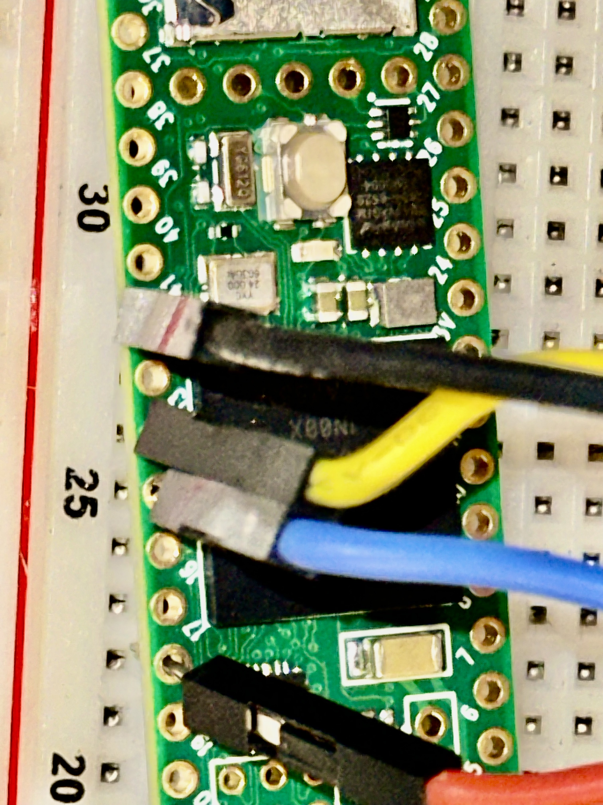
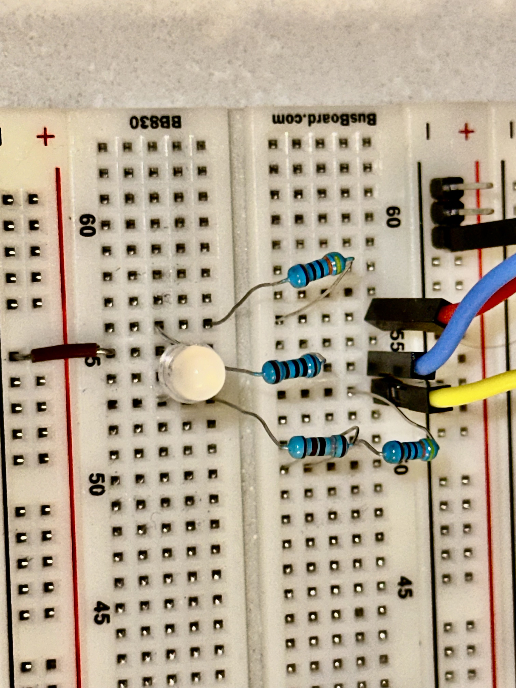
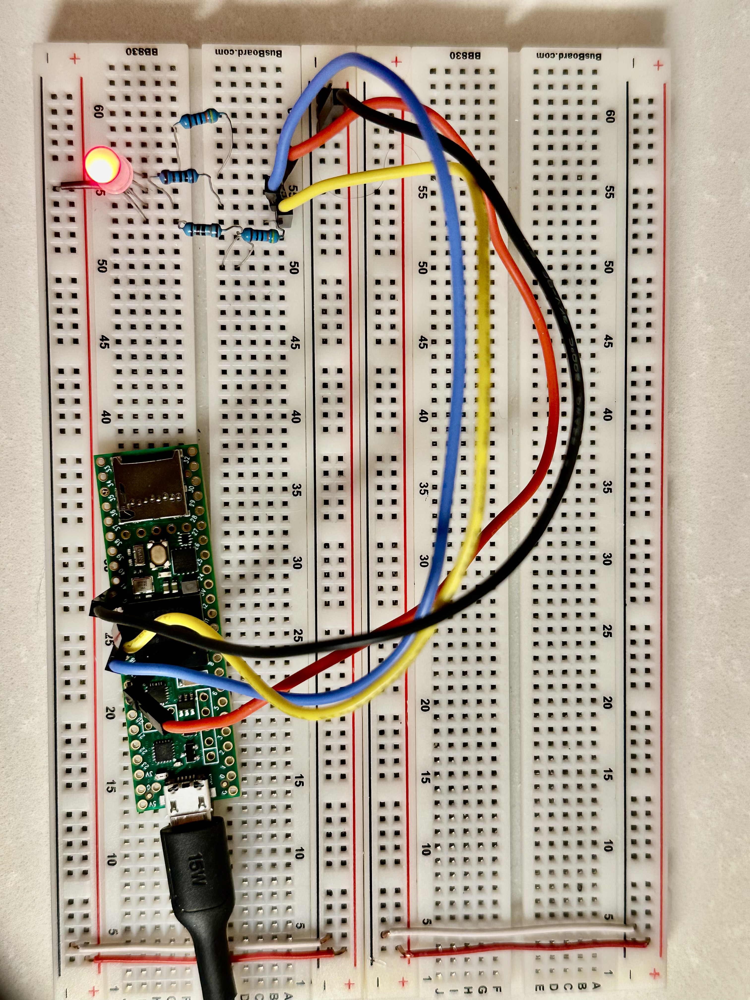
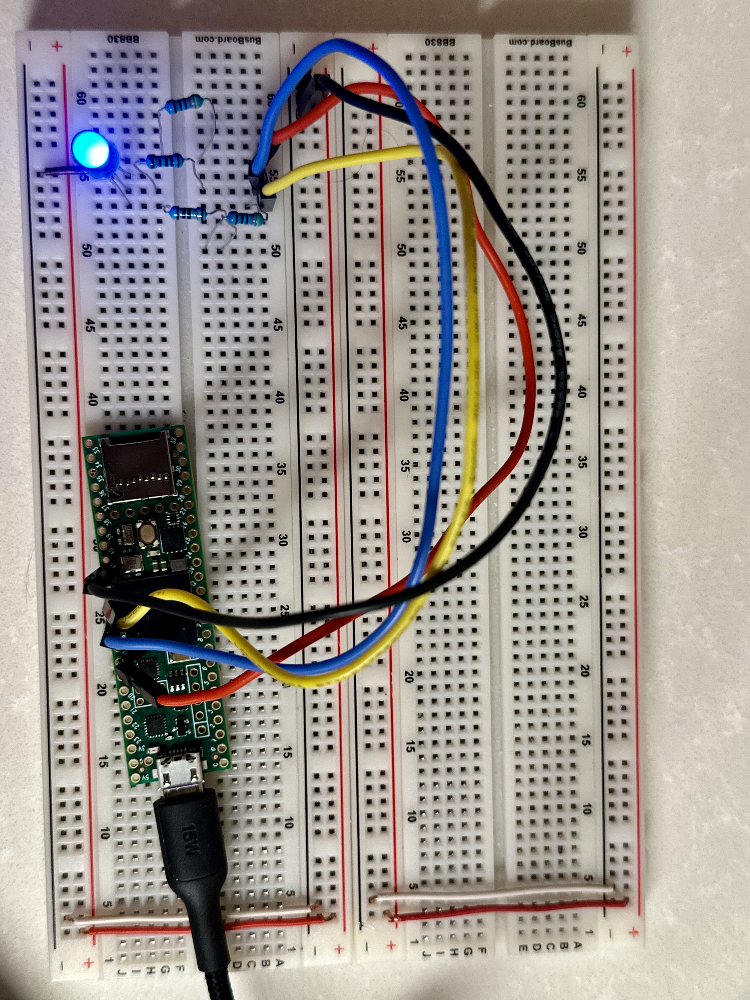
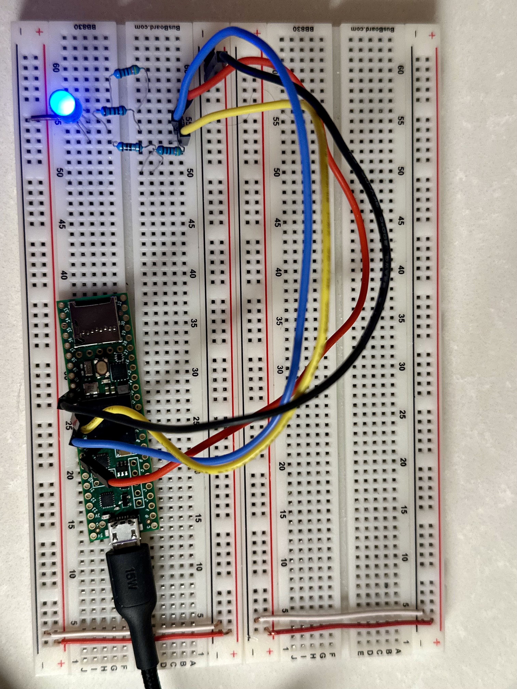

# Hardware — SOS RGB-LED breadboard

A single 4-lead **RGB LED** on a breadboard, driven by a Teensy 4.1.

## Wiring

| LED lead | Connects to | Teensy pin | Notes |
|---|---|---|---|
| Common (cathode) | Ground rail → a Teensy `GND` pin | `GND` | **Common-cathode**: common → GND |
| Red   | via resistor | **18** | Channel lit when pin is HIGH |
| Green | via resistor | **14** | Channel lit when pin is HIGH |
| Blue  | via resistor | **15** | Channel lit when pin is HIGH |

- **The LED is powered by the signal pins, not a power rail.** A GPIO pin driven
  HIGH sources ~3.3 V through the resistor into that color's anode; current returns
  through the common cathode to `GND`. You do **not** need to wire the `3.3V` pin to
  anything — the demo uses no separate LED supply. (`3.3V` is a regulated *output*
  from the Teensy, and `VIN` is where USB feeds in 5 V; neither is used here.)
- **Common-cathode** part: the common lead goes to **GND**, so each channel lights
  when its pin is HIGH (non-inverted). For a common-anode part (common → 3.3 V,
  channels active-LOW), set `kCommonAnode = true` in
  `lib/TeensySos/src/TeensyRgbLedAdapter.hpp` — the single canonical setting that both
  the PlatformIO and Arduino CLI frontends compile.
- Each color leg is **resistor-protected** (current-limiting resistor in series).
- The Teensy 4.1 has **two** on-board LEDs, which are easy to confuse: an **orange
  user LED on pin 13** (`LED_BUILTIN`, unused by this demo) and a **separate red
  bootloader/status LED**. A repeating N-blinks-then-pause on the **red** LED is the
  Teensy's own status/fault indicator — **not** this firmware, which drives neither
  on-board LED. The SOS pattern is on the external RGB LED only.

### Two connections people miss

Both were the actual culprits during bring-up — check them first if nothing lights:

1. **The three signal jumpers must physically seat on the Teensy pins 18/14/15.**
   Landing them in the right breadboard *columns* isn't enough if the Teensy end
   isn't in the row — the anode path is then open and the LED stays dark.
2. **The LED's common must reach a Teensy `GND` pin.** A ground *rail* only works if
   a jumper actually bonds it to a `GND` pin; otherwise there's no return path.

## Reference photos

**Teensy signal pins** — the three jumpers seated on pins **18 / 14 / 15**. Seating them
on the Teensy pins (not merely in the right breadboard column) is what actually closes the
anode path; an open pin here is the single most common "nothing lights" cause.

**LED + per-channel resistors** — the common-cathode RGB LED with a current-limiting
resistor on each color leg, and the common returning to the ground rail. The green
channel deliberately uses a **larger** resistor than red/blue to balance *perceived*
brightness (green reads brightest to the eye).

**Each color driven** — the LED lit on each channel in turn (as the diagnostic sweep and
the SOS program exercise them):

| Red (pin 18) | Green (pin 14) | Blue (pin 15) |
|:---:|:---:|:---:|
|  |  |  |

## What you should see

Repeating **SOS** in Morse, each letter in its own color:

| Letter | Morse | Color | Marks |
|---|---|---|---|
| S | `. . .` | Red   | three short blinks |
| O | `— — —` | Green | three long blinks |
| S | `. . .` | Blue  | three short blinks |

Timing uses the standard Morse ratios with a 200 ms base unit (dot = 200 ms,
dash = 600 ms, gap between symbols = 200 ms, between letters = 600 ms, and a
1.4 s word gap before the pattern repeats). Change the base unit in one place —
`SosController::kDefaultUnitMs` in `lib/TeensySos/src/SosController.hpp` — or pass an
explicit `unit_ms` to the `SosController` constructor in each composition root.

## Resistor selection & brightness balancing

Driving the LED directly from 3.3 V GPIO pins, keep each channel at or below
**~4 mA** — PJRC's recommended per-pin output current for the Teensy 4.1. (The
IMXRT pads can be configured for higher drive strength, but 4 mA keeps a comfortable
margin.) The three colors do **not** want the same resistor — for two independent
reasons they must be tuned individually:

- **Forward voltage.** Red (Vf ≈ 1.9 V) has plenty of headroom on 3.3 V; green and
  blue (Vf ≈ 3.0–3.3 V) sit right at the rail, so they need *smaller* resistors just
  to pass useful current. A large resistor makes blue effectively dark.
- **Eye sensitivity.** Human vision peaks at green (~555 nm) and is weakest at blue,
  so at equal current green *looks* far brighter and blue dimmest. Balancing
  **perceived** brightness therefore pushes green toward **more** resistance and
  blue toward **less** — the opposite of the headroom argument for green.

Values **bench-tuned for this specific LED** (Vf varies by part — measure yours):

| Channel | Resistor | Measured current on this LED | Notes |
|---|---|---|---|
| 🔴 Red | ~**440 Ω** | ~3.2 mA (Vf ≈ 1.9 V) | the brightness reference |
| 🟢 Green | ~**470 Ω – 1 kΩ** | ≪ 1 mA | raise until it stops out-shining red |
| 🔵 Blue | ~**47 – 100 Ω** | ~2 mA at 47 Ω (Vf ≈ 3.2 V) | keep small; blue needs the current |

All three stay at or under ~4 mA **for this LED**. The blue figure depends on its
forward voltage: because Vf ≈ 3.2 V, a 47 Ω resistor still only passes ~2 mA — but a
blue die with a *lower* Vf would draw more, so **measure your part** and raise the
resistor if it exceeds ~4 mA. Do not treat "small resistor is always safe on blue" as
a general rule.

**Alternative (real circuits, not this demo):** balance brightness in firmware with
per-channel PWM (`analogWrite`, pins 14/15/18 are PWM-capable) instead of juggling
resistor values — one middling resistor per channel, brightness set in code. Kept out
of the demo on purpose so the circuit stays maximally conventional and readable.

**For equal, punchy brightness on all three:** the clean options depend on the LED's
common polarity. Because this part is **common-cathode**, per-channel *low-side*
NPN/N-MOSFET switches do **not** apply (the cathodes share GND); you would need
per-anode *high-side* switching (PNP/P-MOSFET) or, better, a dedicated constant-current
LED driver IC. Per-channel low-side NPN/N-MOSFET drivers from 5 V are the natural fit
for a **common-anode** LED instead. Either topology gives green/blue the
forward-voltage headroom that a 3.3 V rail lacks.
